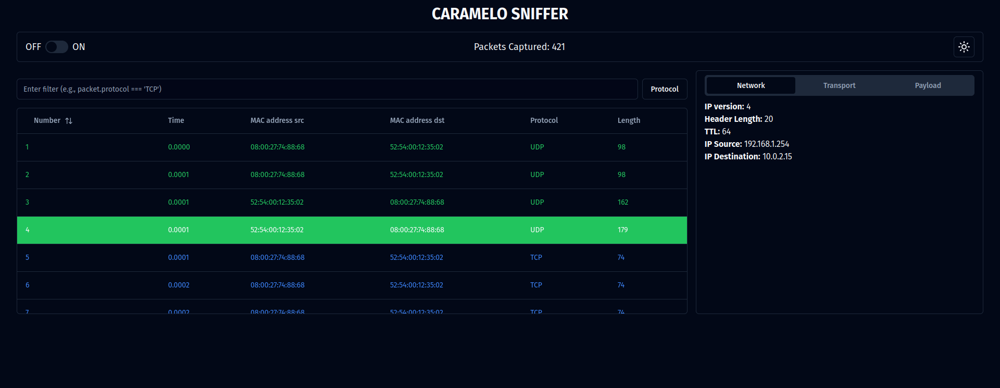

# Caramelo Sniffer

This project is a packet sniffer application with a client-server architecture. The backend is built with Python for packet capturing and Flask to create the endpoints, while the frontend is developed using Next.js, TypeScript, and Shadcn UI to provide a user-friendly interface.

## Preview


## Installation

Clone the repository:

```bash
git clone https://github.com/kelvinleandro/caramelo-sniffer-react.git
```

### Server Setup

1. Navigate to the server directory:

```bash
cd caramelo-sniffer-react/server
```

2. Create a virtual environment within the directory:

```bash
python3 -m venv .venv
```

3. Activate the virtual environment:

```bash
source .venv/bin/activate
```

4. Install required Python packages:

```bash
pip install -r requirements.txt
```

### Client Setup

1. Navigate to the client directory:

```bash
cd ../client
```

2. Install required Node.js packages:

```bash
npm install
```

## Usage

### Server

1. Inside the server folder, switch to the root user:

```bash
sudo su
```

2. Activate the virtual environment:

```bash
source .venv/bin/activate
```

3. Run the Flask application:

```bash
python3 app.py
```

### Client

1. Inside the client folder, start the development server:

```bash
npm run dev
```

2. Open your browser and navigate to http://localhost:3000 to access the application interface.

## Features

- **Table Management:** Order packets by packet number and filter the table based on the transport protocol.
- **Layer Information:**
  - **Data Link Layer:** Displays information about the data link layer.
  - **Network Layer:** Provides details for IPv4 and IPv6.
  - **Transport Layer:** Shows information for TCP, UDP, and ICMP
- **Payload Information:** Displays the payload of each packet.

## Notes

- Ensure you are running Linux as the application is specifically designed for this operating system.
- Ensure you have Python 3 and Node.js installed on your system.
- The server must be running to serve API endpoints to the client application.